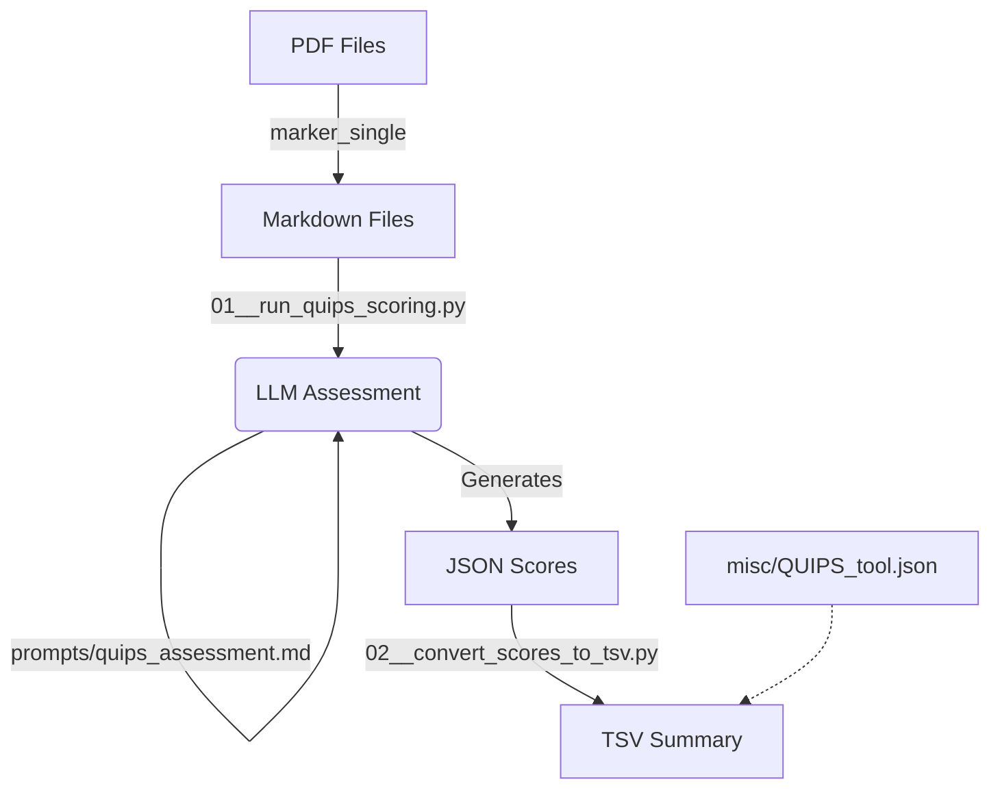

# QUIPS Clinical Paper Scoring Agent

This repository contains an automated pipeline for performing **Risk of Bias (RoB)** assessments on clinical prognosis studies using the **Quality In Prognosis Studies (QUIPS)** tool. It leverages Large Language Models (LLMs) via OpenRouter to act as a Virtual Clinical Expert, providing structured, evidence-based evaluations.

## 🚀 Overview

The pipeline automates the critical appraisal process by:
1.  **Ingestion**: Reading clinical papers converted from PDF to Markdown.
2.  **Assessment**: Applying the 6 domains of the QUIPS tool:
    *   Study Participation
    *   Study Attrition
    *   Prognostic Factor Measurement
    *   Outcome Measurement
    *   Study Confounding
    *   Statistical Analysis and Reporting
3.  **Output**: Generating high-quality, structured JSON reports containing ratings, verbatim evidence snippets, and expert reasoning.

## 🔄 Workflow



## 📁 Project Structure

*   `00__run_quips_scoring.py`: The primary execution script for LLM assessment.
*   `data_md_converted/`: Input directory containing clinical papers in Markdown format.
*   `prompts/quips_assessment.md`: The system prompt defining the "Virtual Clinical Expert" persona and assessment logic.
*   `misc/QUIPS_tool.json`: The master schema for the QUIPS assessment domains and items.
*   `misc/QUIPS_Tool_Background_and_Application.md`: Methodological background on the QUIPS instrument.
*   `outputs/`: Structured JSON scoring results, organized by study group.
*   `.env`: Configuration file for API keys (not tracked in git).

## 🛠 Setup

### 1. Prerequisites
*   Python 3.8+
*   OpenRouter API Key

### 2. Installation
```bash
pip install openai python-dotenv
```

### 3. Configuration
Create a `.env` file in the root directory and add your OpenRouter API key:
```env
OPENROUTER_API_KEY=your_openrouter_key_here
```

## 🔄 Preprocessing: PDF Conversion

Before scoring, PDF papers must be converted to clean Markdown text. We use `marker_single` for high-quality local conversion that preserves layout logic without unnecessary image extraction overhead.

**Command Example:**
```bash
./convert_pdfs.sh
```
Or for a single file:
```bash
marker_single /path/to/paper.pdf --output_dir /output/dir_md --disable_image_extraction
```
*Note: The script processes all pages by default and auto-detects languages (including Spanish, Portuguese, and Chinese).*

## 🧠 Methodological Refinements

To ensure rigorous and reproducible assessments, we have implemented specific refinements based on expert feedback and methodological literature:

### 1. Distinction between "No" and "Unsure"
To prevent hallucinations and enforce strict reporting standards, the LLM is instructed to apply the following logic:
*   **"No" (Reporting Deficit):** Used for **reporting items** (e.g., "Is the source population described?"). If the text fails to describe the item, the rating is "No". This penalizes poor reporting.
*   **"Unsure" (Judgment Uncertainty):** Used for **methodological judgment items** (e.g., "Is there adequate participation?"). If the text provides insufficient information to form a judgment, the rating is "Unsure". This acknowledges epistemic uncertainty rather than assuming a negative.

### 2. Overall Risk of Bias Calculation
Following the recommendation of **Grooten et al. (2019)** [PMID: 31093575], the Overall Risk of Bias for a paper is calculated **deterministically** during the post-processing phase (not by the LLM). This ensures consistency and avoids the subjectivity of "summated scores" which are generally discouraged in the original QUIPS documentation (Hayden et al., 2013).

**Algorithm:**
*   **Low Risk (Green):** All domains are Low Risk **OR** (Maximum 1 Moderate Risk **AND** 0 High Risk).
*   **High Risk (Red):** ≥ 1 High Risk domain **OR** ≥ 3 Moderate Risk domains.
*   **Moderate Risk (Yellow):** Any combination not meeting the criteria for Low or High.

---

## 📈 Usage

To run the scoring agent:

```bash
python 01__run_quips_scoring.py
```

The script will interactively ask for:
1.  **Input directory**: Where the `.md` papers are located (e.g., `data_md_converted/1_Giuliano_2021`).
2.  **Output directory**: Where to save the JSON results (e.g., `outputs/1_Giuliano_2021`).

Press **Enter** for both to use the default directories. The script is configured with `temperature=0.0` to ensure deterministic, high-fidelity results.

### 📊 Summarizing Results

After processing papers into JSON files, you can aggregate them into a single TSV file for analysis in R or Excel:

```bash
python 02__convert_scores_to_tsv.py
```
This script:
1.  Maps the complex JSON structure to a flat table with intuitive column names.
2.  **Automatically calculates the 'Overall_Risk'** column based on the Grooten et al. (2019) criteria described above.

## 📊 Output Format

The agent produces a JSON file for each paper with the following structure:
*   **Metadata**: Title, author, year, and model used.
*   **Domain Ratings**: High, Moderate, or Low risk for each of the 6 domains.
*   **Itemized Evidence**: 
    *   `rating`: Yes, Partial, No, or Unsure.
    *   `evidence_snippet`: A verbatim quote from the text.
    *   `reasoning`: Expert explanation of the rating.

## ⚖️ Disclaimer
This tool is intended for research support and systematic review assistance. All automated assessments should be verified by human clinical experts.